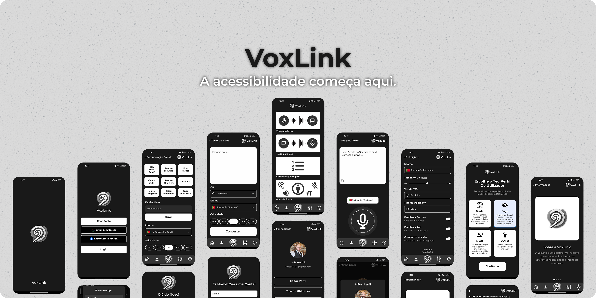

# 🎙️ VoxLink – App de Acessibilidade Multissensorial

A VoxLink é uma aplicação móvel desenvolvida com **React Native + Expo**, pensada para facilitar a comunicação de pessoas com limitações **auditivas**, **visuais** e/ou **vocais**. Através de **voz-para-texto**, **texto-para-voz**, comandos por voz e uma interface acessível e intuitiva, a app promove inclusão digital para todos os perfis de utilizador.



---


## 📱 Funcionalidades

- 🗣️ **Texto para Voz (TTS):** 
   Converte texto escrito em fala, com seleção de idioma, voz e velocidade.
- 🎤 **Voz para Texto (STT):** 
   Transcreve fala automaticamente com deteção de silêncio e tradução integrada.
- ⚡ **Comunicação Rápida:** 
   Mensagens pré-definidas e campo de escrita livre para comunicar rapidamente.
- 🧠 **Comandos por Voz:** 
   Navegação por voz: “abrir definições”, “ativar som”, “ler texto”, etc.
- 🛠️ **Definições de Acessibilidade:** 
   Tema, idioma, vibração, som, tipo de utilizador e tamanho da fonte ajustáveis.
- 👤 **Perfil do Utilizador:**
  Edição de nome, imagem e palavra-passe com autenticação Firebase.

---

## ⚙️ Tecnologias Utilizadas

A aplicação foi desenvolvida com **React Native** e o ecossistema **Expo**. Utiliza **Firebase Authentication** e **Firestore** para gestão de utilizadores e dados. As funcionalidades de voz e tradução são suportadas pelas APIs da **Google Cloud** (Text-to-Speech, Speech-to-Text, Translation). Adicionalmente, foram usadas bibliotecas como:

- **expo-av**, **expo-speech** (áudio)
- **i18n-js** (tradução)
- **react-native-reanimated** (animações)
- **AsyncStorage** (armazenamento local)
- **expo-image-picker** (imagem de perfil)

---

## 🚀 Como Executar a App

### 1. Instalar dependências

```bash
npm install
```

### 2. Iniciar a aplicação com Expo

```bash
npx expo start
```

Depois, podes abrir a app:

- Num emulador Android (Android Studio)
- Num simulador iOS (Xcode)
- No teu telemóvel com a app **Expo Go**

---

## 🛠️ Configurações Necessárias

No ficheiro `app.json`, garante que tens a chave da API Google:

```json
"extra": {
  "googleTtsKey": "A_TUA_API_KEY_GOOGLE"
}
```

---

## 📂 Estrutura Base do Projeto

```
/app
  /screens         → ecrãs principais (STT, TTS, FastText, etc.)
  /components      → componentes reutilizáveis (navbar, textos, etc.)
  /context         → contextos globais (auth, som, voz, fonte, etc.)
  /utils           → lógica de TTS, STT, tradução e comandos de voz
```

---

## 📄 Licença

Este projeto foi desenvolvido no contexto académico da **UTAD** – Licenciatura em Engenharia Informática, unidade curricular **Interação Pessoa-Computador (2024/2025)**.

---

## 💬 Contacto

Para sugestões ou contribuições, contacta os autores ou abre uma _issue_ neste repositório.

---

> Feito com ❤️ por  Luís Lemos
